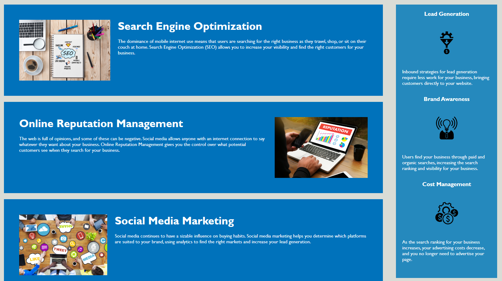
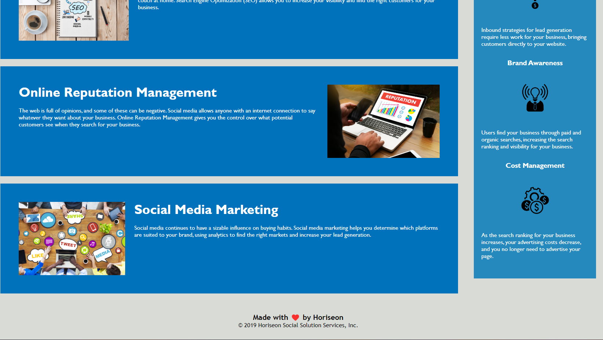

# Week 1 Challenge - Horiseon Website

## Description

In this challenge, we were giving a website with html and css already provided. We had to the knowledge that we have learned from the previous class week to clean up the css as well as make sure functionality of the webpage was correct as well as add semantic HTML elements to the already existing index.html. 

## Installation

The Url for the Webpage - 

The Url for the Repository - https://github.com/A-Speece/Week_1_challenge.git 

## Usage

This challenge was used to gauge are knowledge from the class and see how much we have learned. 

## Screenshot

